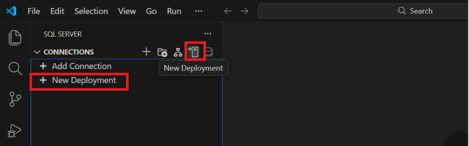
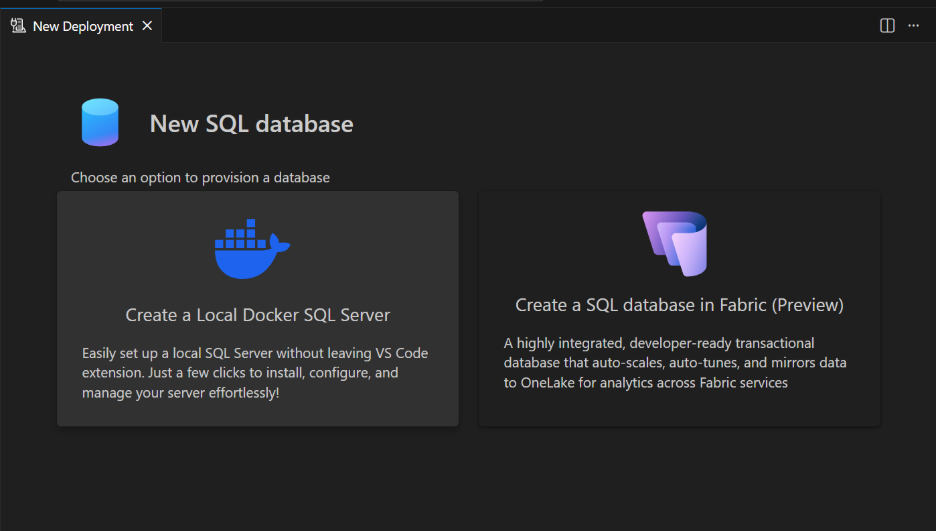
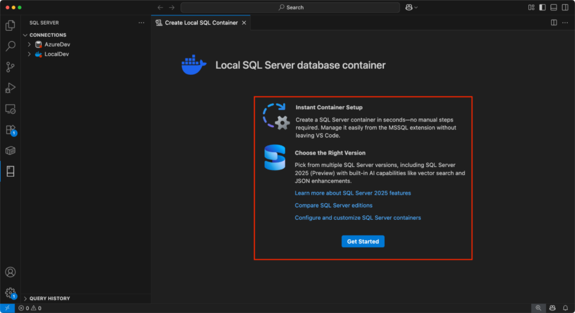
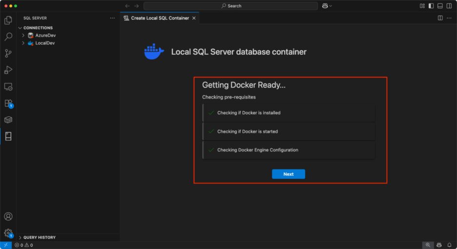
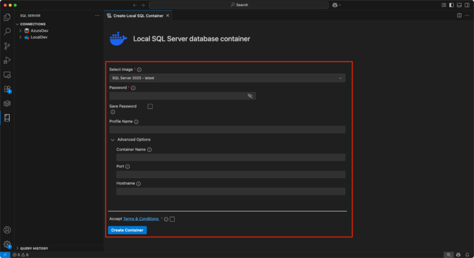

# VS Code MSSQL Extension - Lab Prerequisites

**30-second overview:** Install VS Code, Docker Desktop, and the MSSQL extension. Then create a local SQL Server container and load the AdventureWorks sample database.

**Expected time:** 10–15 minutes

---

## Prerequisites

1. **Visual Studio Code**
   Download: https://code.visualstudio.com

2. **Docker Desktop**
   Download: https://www.docker.com/products/docker-desktop

3. **SQL Server (mssql) Extension**
   - Open VS Code
   - Open Extensions (`Ctrl+Shift+X` / `Cmd+Shift+X`)
   - Search "SQL Server (mssql)"
   - Click **Install**

---

## Setup Steps

### Step 1: Create a Local SQL Server Container

1. In the **SQL Server** view, expand **Connections**
2. Click **New Deployment**

   

3. Select **Create a Local Docker SQL Server**

   

4. Review the overview, then click **Get Started**

   

5. Wait for Docker checks to complete, then click **Next**

   

6. Configure deployment settings:

   

   - **SQL Server version:**
     - Windows/Linux: `SQL Server 2025 - latest`
     - macOS: `SQL Server 2022 - latest` (2025 not supported)
   - **Password:** Enter an SA password
   - **Accept license terms**
   - Click **Create Container**

### Step 2: Load AdventureWorks Database

1. Download the SQL script: [AdventureWorksLT2022.sql](https://gist.github.com/croblesm/25c526d206ae1402b555837e9f17a302)
2. Open the file in VS Code
3. Connect to your local SQL Server
4. Execute the script (~2 minutes)

---

## Troubleshooting

- **Docker not installed:** Download from https://www.docker.com/products/docker-desktop
- **Docker not running:** Start Docker Desktop before proceeding
- **Extension conflicts:** Disable non-essential VS Code extensions
- **Script takes too long:** Script execution typically takes ~2 minutes

---

## Resources

- [Container Demo (YouTube)](http://aka.ms/vscode-mssql-container-demo)
- [Container Documentation](http://aka.ms/vscode-mssql-container-docs)

---

For detailed instructions, see [docs/lab-prereq.md](docs/lab-prereq.md).
